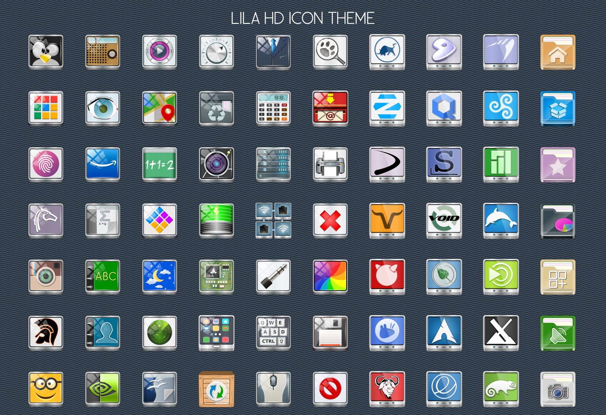

# Lila HD Icon Theme (Official 2026 Reboot) 🎨

**Lila HD** is a professional, high-definition SVG icon theme for Linux. 
After 4 years of meticulous handcrafted design, every single icon has been optimized for modern desktops (GNOME, KDE Plasma, XFCE, Cinnamon).

---

## 🌍 Languages / Lingue / Idiomas
- [English](#english) | [Italiano](#italiano) | [Español](#espanol)

## 🚀 Features (English)
* **Handcrafted Quality:** 4 years of one-by-one SVG creation.
* **Ultra-Lightweight:** Optimized for maximum performance.
* **Universal Support:** .deb (Debian/Ubuntu), .rpm (Fedora), PKGBUILD (Arch).

### 📥 Installation
1. **Debian/Ubuntu:** `sudo apt install ./lila-hd-icon-theme-3.0.deb`
2. **Arch Linux:** Use the provided `PKGBUILD`.
3. **Manual:** Run `./install.sh`

---

## 🇮🇹 Versione Italiana
**Lila HD** è il frutto di 4 anni di lavoro costante. Ogni icona è stata disegnata a mano in formato SVG per garantire la massima nitidezza su schermi 4K e oltre. Questa versione 2026 è il reboot ufficiale del progetto.

### 🤝 Contribuire
Sei un designer? Scarica il file `template.svg` (nella cartella templates) e crea nuove icone seguendo lo stile Lila!

---

## 🇪🇸 Versión Española
**Lila HD** es un tema de iconos de alta definición profesional. Después de 4 años de trabajo artesanal, cada icono ha sido optimizado para ser ligero y elegante en cualquier entorno Linux.

---

## 🛠 Maintainer
**IlNanny** (Original Creator)

---

## 🌐 Universal Installation / Installazione Universale / Instalación Universal
*(Gentoo, Slackware, OpenSUSE, Arch, etc.)*

### 🇺🇸 English
If your distribution is not listed, use the universal script:
1. Open terminal in the folder.
2. Run: `chmod +x install.sh && sudo ./install.sh`

### 🇮🇹 Italiano
Se la tua distribuzione non è tra quelle elencate, usa lo script universale:
1. Apri il terminale nella cartella.
2. Esegui: `chmod +x install.sh && sudo ./install.sh`

### 🇪🇸 Español
Si su distribución no aparece en la lista, use el script universal:
1. Abra el terminal en la carpeta.
2. Ejecute: `chmod +x install.sh && sudo ./install.sh`

---
